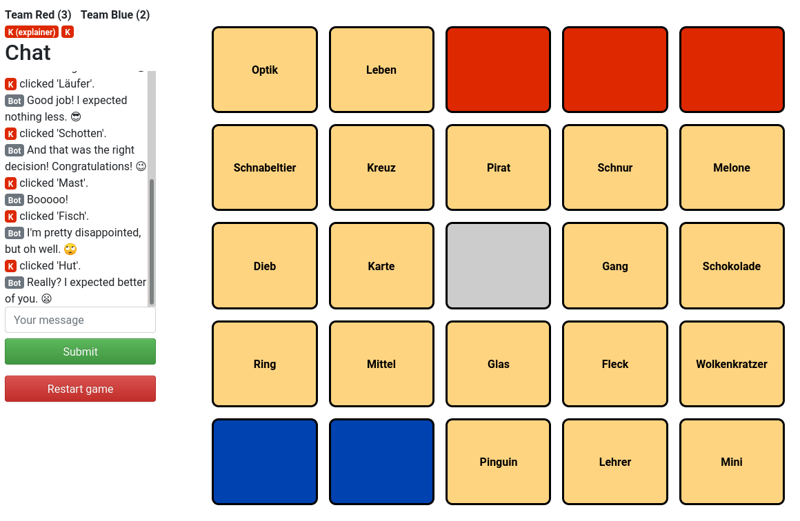
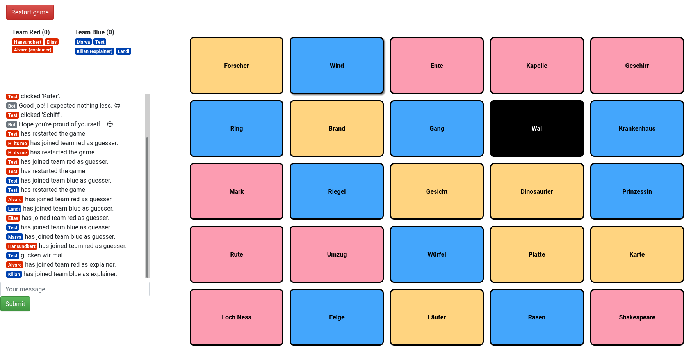

# Codenames

[](https://github.com/python/black)
[](https://github.com/dieret/codenames/blob/master/LICENSE.txt)
[](https://git-scm.com/book/en/v2/GitHub-Contributing-to-a-Project)

Experimental/educational implementation of an online version of a [Codenames](https://en.wikipedia.org/wiki/Codenames_(board_game)),
a popular word game.

Czech Games Edition have since released an official (and much more complete) online
version which you can play [here](https://codenames.game/).

A noteable other implementation is [KodeNames](https://github.com/ninjabunny/KodeNames).

☠️ This server was never meant to be deployed in public so it probably has more security issues than we can count ☠️

## Features

* Multiple rooms
* Loading words from a wikipedia article instead of the default selection of words (german/english)

## Local run

Simply run

```bash
./main.py
```

## Screenshots



View of one of the explainers:


